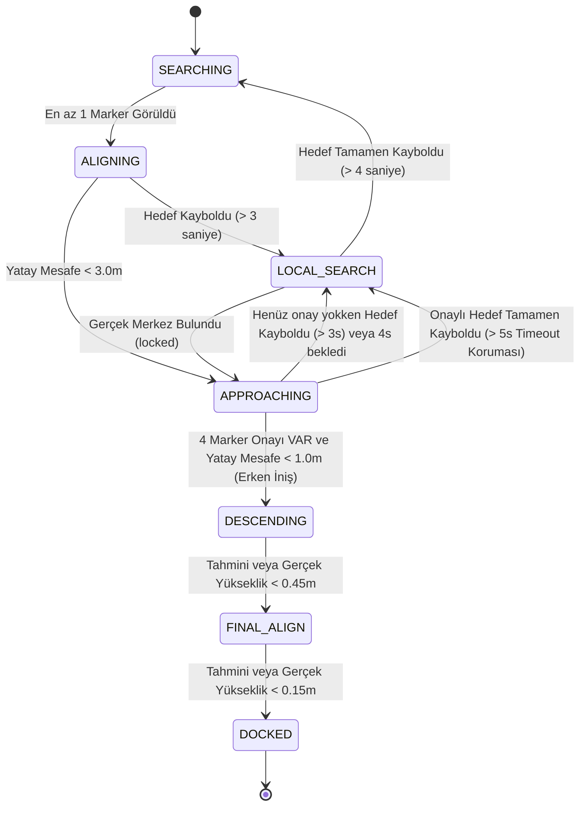

# Otonom Yanaşma Sistemi (Subsea Docking) FSM Detayları

Bu doküman, sualtı aracının (ROV) yanaşma platformuna otonom olarak kenetlenmesini sağlayan Sonlu Durum Makinesinin (FSM - Finite State Machine) güncel çalışma mantığını detaylandırmaktadır. Sisteme **Hafızalı Güdümlü İniş (Fire and Forget)** mekaniği entegre edilmiştir.

## 🔄 FSM Durum Akış Diyagramı

Aşağıdaki diyagram, aracın hangi şartlar altında hangi modlar arasında geçiş yaptığını gösterir:

---

## 🛑 Durumlar (States) ve Detaylı Açıklamaları

### 1. SEARCHING (Arama Modu)
Sistemin varsayılan başlangıç modudur.
*   **Motor Davranışı:** Araç ilk 5 saniye ileri gider (`vx = 0.15`). 5 saniyeden sonra etrafı taramak için olduğu yerde döner (`vyaw = 0.2`).
*   **Geçiş Şartı:** Kamera geçerli en az 1 adet ArUco marker tespit ettiği an hızla **ALIGNING** moduna geçer.

### 2. ALIGNING (Kaba Hizalanma Modu)
Hedefin kabaca görüş alanına alındığı ve yaklaşılmaya başlandığı moddur.
*   **Motor Davranışı:** PID kontrolcüleri (X, Y ve Yaw) devrededir. İrtifa sabittir (`vz = 0.0`).
*   **Geçiş Şartları:**
    *   Araç hedefin merkezine yatay eksende 3 metreden fazla yaklaşırsa (`d_h < 3.0`) -> **APPROACHING**
    *   Marker 3 saniyeden uzun süre gözden kaybolursa -> **LOCAL_SEARCH**

### 3. APPROACHING (Hafızalı Yaklaşma ve Hedef Kilidi)
Aracın 4 marker'ı bir arada görerek merkezin "gerçek" konumunu beynine kazıdığı (Fire and Forget) moddur.
*   **Motor Davranışı:** Kalman filtresi ve PID kullanılarak araç ofsetli merkeze doğru ilerler.
*   **Hedef Kayması (Target Snap) Koruması:** Araç 4 marker onayı almışsa, yaklaştıkça sadece kenardaki 1 veya 2 marker'ı gördüğünde köşelere sapmamak için bunları tamamen yoksayar (Kör Süzülüşe geçer).
*   **Geçiş Şartları:**
    *   **İniş İzni:** 4 marker onayı alındıysa ve yatay mesafe 1.0 metreye düştüyse (Kör bile olsa) -> **DESCENDING**
    *   **Timeout Koruması:** 4 marker onayı alınmasına rağmen hedef 5 saniye boyunca (balık vb. sebebiyle) hiç görülmezse, havada asılı kalmamak için onay iptal edilir -> **LOCAL_SEARCH**
    *   Onay alınamadıysa ve 4 sn geçtiyse -> **LOCAL_SEARCH**

### 4. LOCAL_SEARCH (Sarmal Kurtarma Modu)
Araç hedefi kaybettiğinde veya tek bir köşede takılı kaldığında devreye giren kurtarma manevrasıdır.
*   **Motor Davranışı:** Yavaşça yukarı doğru yükselmeye başlar (`vz = 0.15`). Yükselirken trigonometrik dalgalarla (`vx = cos(t)`, `vy = sin(t)`) uzayda bir sarmal (helezon) çizer.
*   **Amacı:** Yükselerek FOV'u (görüş alanını) genişletmek ve kayıp gerçek merkezi tekrar kadraja sokmak.
*   **Geçiş Şartları:**
    *   Gerçek merkez (`locked == True` yani 2 diyagonal, 3 veya 4 marker) bulunduğu an sarmal kesilir -> **APPROACHING**
    *   4 saniye boyunca hiçbir şey görünmezse -> **SEARCHING**

### 5. DESCENDING (Güdümlü ve Kör İniş Modu)
Aracın 1.0 metreden itibaren aşağı çökmeye başladığı aşamadır.
*   **Motor Davranışı:** Araç aşağı doğru sabit bir hızla çökmeye başlar (`vz = -0.15`). Önceki versiyonların aksine **Yatay Motorlar Açıktır**. Araç inerken kamerasıyla gerçeği merkeze (`locked = True`) yakalarsa anında sağa sola kayarak kendini merkeze düzeltir. Eğer hiçbir şey görmüyorsa son hızını sönümleyerek (coasting) süzülmeye devam eder.
*   **Kör İniş (Dead Reckoning):** Araç marker'ları kaybettiğinde yüksekliğini saniye ve düşüş hızına (`last_vz_cmd`) göre matematiksel olarak hesaplamaya devam eder.
*   **Geçiş Şartı:** Tahmini veya gerçek yükseklik 45 cm'nin altına düştüğünde -> **FINAL_ALIGN**

### 6. FINAL_ALIGN (Son Dokunuş / Yavaş İniş Modu)
Aracın platforma sert çarpmasını önlemek için aşağı düşüş hızını yavaşlattığı (`vz = -0.08`) yastıklama modudur.
*   **Geçiş Şartı:** Yükseklik 15 cm'nin altına düştüğünde araç platforma fiziksel olarak girdiğini/oturduğunu anlar -> **DOCKED**

### 7. DOCKED (Görev Tamamlandı)
Otonom yanaşma işleminin bittiği terminal durumudur. Motor komutları kalıcı olarak sıfırlanır (`vx = 0, vy = 0, vz = 0, vyaw = 0`).
