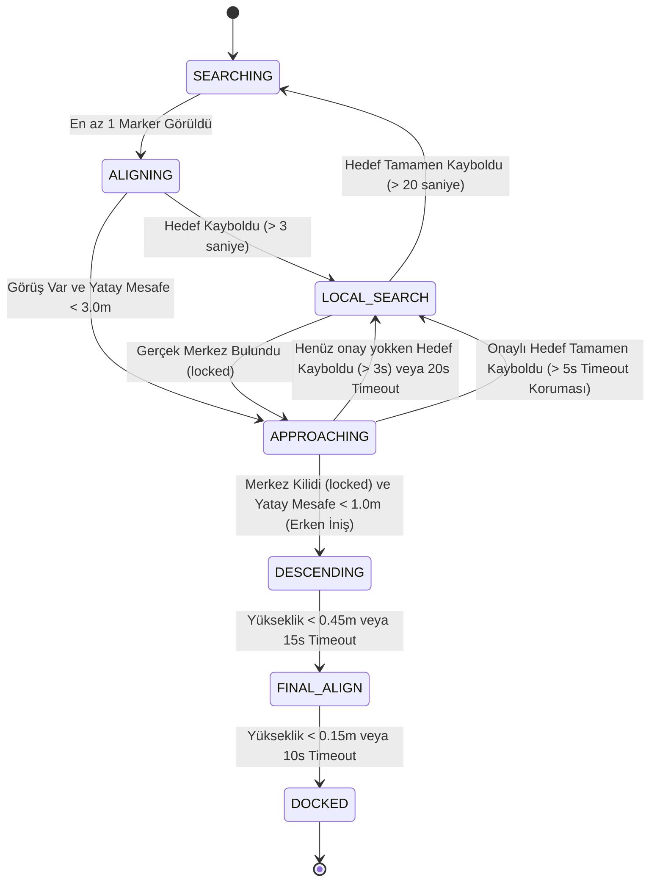

# Otonom Yanaşma Sistemi (Subsea Docking) FSM Detayları

Bu doküman, sualtı aracının (ROV) yanaşma platformuna otonom olarak kenetlenmesini sağlayan Sonlu Durum Makinesinin (FSM - Finite State Machine) güncel çalışma mantığını detaylandırmaktadır. Sisteme **Hafızalı Güdümlü İniş (Fire and Forget)** mekaniği entegre edilmiştir.

## 🔄 FSM Durum Akış Diyagramı

Aşağıdaki diyagram, aracın hangi şartlar altında hangi modlar arasında geçiş yaptığını gösterir:

---

## 🛑 Durumlar (States) ve Detaylı Açıklamaları

### 1. SEARCHING (Arama Modu)
Sistemin varsayılan başlangıç modudur. Arama davranışı zaman aşamalı ve gelişmiştir:
*   **Motor Davranışı (Aşama 1 - İlk 5 sn):** Araç dikey olarak yükselir (`vz = 0.15`). Amaç görüş açısını (FOV) genişleterek hedefi aramaktır.
*   **Motor Davranışı (Aşama 2 - 5 ila 15. sn arası):** Dikey yükselme durdurulur, araç olduğu yerde kendi etrafında döner (`vyaw = 0.2`) ve 360 derece tarama yapar.
*   **Motor Davranışı (Aşama 3 - 15. sn ve sonrası - Gelişmiş Arama):** Genişleyen çokgen mantığıyla 15 saniyelik döngüler halinde hareket edilir:
    *   *İlk 5 saniye:* Belirli bir yöne doğru ileri gidilir (ileri hız süresi uzadıkça yavaşça `0.15`'ten `0.35`'e artırılır).
    *   *Kalan 10 saniye:* Durup kendi etrafında 360 derece dönerek tarama yapılır.
*   **Geçiş Şartı:** Kamera geçerli en az 1 adet platform ArUco marker'ı tespit ettiği an hızla **ALIGNING** moduna geçer. SEARCHING moduna her girişte tüm yetki ve filtre hafızası sıfırlanır.

### 2. ALIGNING (Kaba Hizalanma Modu)
Hedefin kabaca görüş alanına alındığı ve yaklaşılmaya başlandığı moddur.
*   **Motor Davranışı:** PID kontrolcüleri (X, Y ve Yaw) devrededir. İrtifa sabittir (`vz = 0.0`). Görüş kaybolursa komutlar her döngüde %20 sönümlenir.
*   **Geçiş Şartları:**
    *   Görüş varken araç hedefin merkezine yatay eksende 3 metreden fazla yaklaşırsa (`d_h < 3.0`) -> **APPROACHING**
    *   Marker 3 saniyeden uzun süre gözden kaybolursa -> **LOCAL_SEARCH**

### 3. APPROACHING (Hafızalı Yaklaşma ve Hedef Kilidi)
Aracın hedefin "gerçek" merkezini belirleyip kilitlendiği ve yaklaşmayı sürdürdüğü moddur.
*   **Motor Davranışı:** Kalman filtresi ve PID kullanılarak araç ofsetli merkeze doğru ilerler. Hedef kaybolduğunda son komut korunur (Hold Last Command), böylece hedefe doğru süzülme hareketi devam eder.
*   **Merkez Kilidi (locked):** Yansımalardan etkilenmemek ve merkezin kesin hesaplandığını doğrulamak için; 2 diyagonal çapraz marker (ID setleri `{28, 96}` veya `{7, 19}`), 3 marker veya 4 marker görüldüğünde kilit (`locked = True`) sağlanır. 20 kare boyunca kilit korunursa iniş yetkisi (`confirmed_4_markers = True`) verilir.
*   **Hedef Kayması (Target Snap) Koruması:** İniş yetkisi alındıktan sonra, kameranın görüş açısının daralması nedeniyle sadece köşe marker'lar görünse bile köşelere sapmamak için bu veriler yoksayılır ve araç kör süzülüşe geçer.
*   **Geçiş Şartları:**
    *   **İniş Yetkisi:** Kilit doğrulanmışsa (`confirmed_4_markers == True`) ve yatay mesafe 1.0 metreye düştüyse -> **DESCENDING**
    *   **Timeout Koruması (Onaylı):** İniş yetkisi verilmiş olmasına rağmen hedef 5 saniye boyunca hiç görülmezse, havada asılı kalmamak için yetki iptal edilir -> **LOCAL_SEARCH**
    *   **Timeout Koruması (Onaysız):** İniş yetkisi henüz alınamadıysa ve 20 saniye geçmişse -> **LOCAL_SEARCH**
    *   Görüş yoksa ve 3 saniye geçmişse -> **LOCAL_SEARCH**

### 4. LOCAL_SEARCH (Sarmal Kurtarma Modu)
Araç hedefi kaybettiğinde veya tek bir köşede takılı kaldığında devreye giren kurtarma manevrasıdır.
*   **Motor Davranışı:** İlk 2 saniye boyunca yavaşça yukarı doğru yükselir (`vz = 0.15`), böylece FOV genişletilir. 2. saniyeden sonra yükselme durdurularak sadece yatayda trigonometrik dalgalarla (`vx = 0.2 * cos(t)`, `vy = 0.2 * sin(t)`) sarmal çizilir.
*   **Geçiş Şartları:**
    *   Gerçek merkez (`locked == True` yani 2 diyagonal, 3 veya 4 marker) bulunduğu an sarmal kesilir -> **APPROACHING**
    *   20 saniye boyunca hiçbir şey görünmezse -> **SEARCHING**

### 5. DESCENDING (Güdümlü ve Kör İniş Modu)
Aracın 1.0 metreden itibaren aşağı çökmeye başladığı aşamadır.
*   **Motor Davranışı:** Araç aşağı doğru sabit bir hızla çökmeye başlar (`vz = -0.15`). Yatay motorlar açıktır ve iniş anında merkez kilitlenirse (`locked = True`) anlık düzeltmeler yapar. Görüş yoksa son hızı sönümleyerek kör süzülüş (dead reckoning) yapar.
*   **İniş Güvenliği (Kesin Merkez Filtresi):** İniş modundayken sadece merkezin kesin hesaplanabildiği (`locked = True`) anlarda kameraya güvenilir. Yan yana 2 marker veya tek marker verisi gürültü sebebiyle reddedilir, araç kör süzülüşe geçer.
*   **Kör İniş (Dead Reckoning):** Görüş kaybolduğunda dikey yükseklik `d_v`, son cmd hızına (`last_vz_cmd`) göre matematiksel olarak simüle edilir. Ayrıca görüş koptuğunda `d_h` yatay mesafesi en son bilinen değerde dondurulmak yerine yatay tahminle güncellenir.
*   **Geçiş Şartı:** Yükseklik 45 cm'nin altına düştüğünde veya 15 saniyelik güvenlik zaman aşımı (timeout) dolduğunda -> **FINAL_ALIGN**

### 6. FINAL_ALIGN (Son Dokunuş / Yavaş İniş Modu)
Aracın platforma sert çarpmasını önlemek için aşağı düşüş hızını yavaşlattığı (`vz = -0.08`) yastıklama modudur.
*   **Geçiş Şartı:** Yükseklik 15 cm'nin altına düştüğünde veya 10 saniyelik güvenlik zaman aşımı (timeout) dolduğunda -> **DOCKED**

### 7. DOCKED (Görev Tamamlandı)
Otonom yanaşma işleminin bittiği terminal durumudur. Pixhawk'ın failsafe'e düşmesini veya son komutu tutmasını engellemek için motor komutları her döngüde sürekli sıfırlanır (`vx = 0, vy = 0, vz = 0, vyaw = 0`).
