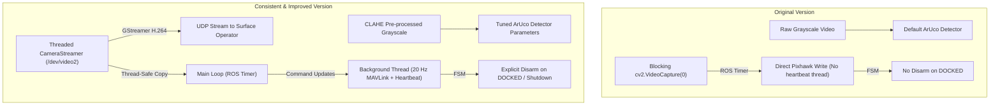

# Changes Log: Original Docking Node vs. Consistent & Improved Version

This document tracks all modifications and enhancements introduced to the autonomous subsea docking codebase to align it with the field-tested camera and telemetry architectures from the **Pipeline Inspection** mission. 

All improvements reside in the `updated_version/` directory. The root files remain unmodified.

---

## 1. High-Level Summary of Changes



---

## 2. File-by-File Changes Matrix

### 📄 `updated_config.py`
Integrated new hardware definition parameters without modifying any mission thresholds, bounds, or math coefficients.

| Parameter | Original | Improved (`updated_version/`) | Rationale |
|---|---|---|---|
| **Camera Device Path** | *None* (hardcoded `0` in node) | `CAMERA_DEVICE = '/dev/video2'` | Integer indices can shift dynamically on USB enumerations; persistent V4L2 device paths are bulletproof on Jetson. |
| **Camera Inversion** | *None* | `CAMERA_FLIP = False` | Allows quick physical orientation adjustments if mounting is upside down. |
| **GStreamer Port** | *None* | `GSTREAMER_PORT = 5603` | Separate port to prevent collision with the pipeline inspection mission (port 5602). |
| **Telemetry IP** | *None* | `GSTREAMER_TARGET_IP = '10.42.0.1'` | Target surface station IP (Monster PC). |
| **Contrast Limits** | *None* | `CLAHE_CLIP_LIMIT = 3.0` & `CLAHE_GRID_SIZE = (8,8)` | Standard limits from pipeline inspection task for turbidity/glare compensation. |

---

### 📄 `updated_vision.py`
Upgraded the image processing pipeline to deal with challenging underwater optical environments.

```diff
 class Vision:
     def __init__(self):
         self.aruco_dict = aruco.getPredefinedDictionary(aruco.DICT_ARUCO_ORIGINAL)
-        self.detector = aruco.ArucoDetector(self.aruco_dict, aruco.DetectorParameters())
+        # [İYİLEŞTİRME] Sualtı için optimize edilmiş ArUco dedektör parametreleri
+        params = aruco.DetectorParameters()
+        params.adaptiveThreshWinSizeMin    = 5
+        params.adaptiveThreshWinSizeMax    = 23
+        params.adaptiveThreshWinSizeStep   = 4
+        params.minMarkerPerimeterRate      = 0.03
+        params.errorCorrectionRate         = 0.6
+        params.polygonalApproxAccuracyRate = 0.05
+        self.detector = aruco.ArucoDetector(self.aruco_dict, params)
+
+        # [İYİLEŞTİRME] CLAHE kontrast iyileştirmesi (sualtı bulanıklığını azaltır)
+        self.clahe = cv2.createCLAHE(
+            clipLimit=CLAHE_CLIP_LIMIT,
+            tileGridSize=CLAHE_GRID_SIZE
+        )
```

```diff
     def process(self, frame):
         gray = cv2.cvtColor(frame, cv2.COLOR_BGR2GRAY)
+        # [İYİLEŞTİRME] CLAHE kontrast iyileştirmesi
+        gray = self.clahe.apply(gray)
+
         corners, ids, _ = self.detector.detectMarkers(gray)
```

---

### 📄 `updated_controller.py`
*No changes made.* 
Both `PID` and `Kalman2D` filters are structurally sound and identical. Defensive imports with absolute path expansion were verified.

---

### 📄 `updated_docking_node.py`
Redesigned the driver node's communication and video flow to introduce asynchronous execution, hardware safety, and remote visualization.

#### 1. Imports & Path Loading
Robust relative imports inside `updated_version/` folder with safe fallbacks:
```python
import os
import sys
sys.path.append(os.path.dirname(os.path.abspath(__file__)))
```

#### 2. Threaded Video Capture & Streaming
Replaced blocking OpenCV capture with `CameraStreamer` background threads and H.264 compression:
```diff
-        self.cap = cv2.VideoCapture(self.video_source)
-        self.cap.set(cv2.CAP_PROP_FRAME_WIDTH, IMAGE_WIDTH)
-        ...
+        self.cam = CameraStreamer(
+            self.video_source, 
+            GSTREAMER_PORT, 
+            'BOTTOM', 
+            flip=CAMERA_FLIP, 
+            monster_ip=GSTREAMER_TARGET_IP
+        )
```
And pushed the debug HUD frames directly to surface GStreamer over UDP:
```diff
-        ret, frame = self.cap.read()
-        if not ret:
-            self.send(0.0, 0.0, 0.0, 0.0)
-            return
+        frame = self.cam.get_frame()
+        if frame is None:
+            return
...
+        # Send debug HUD overlay frame to GStreamer UDP pipeline
+        self.cam.send_debug(frame)
```

#### 3. Heartbeat & Command Threading (20 Hz Asynchronous MAVLink)
Decoupled MAVLink control and Heartbeat scheduling from the main 25 Hz ROS2 timer to eliminate timing drift:
```python
    def _heartbeat_thread(self):
        """Arka planda Pixhawk'a 20 Hz frekansta Heartbeat ve son hareket komutlarını gönderir."""
        while self._running and rclpy.ok():
            try:
                if self.master:
                    self.master.mav.heartbeat_send(
                        mavutil.mavlink.MAV_TYPE_GCS,
                        mavutil.mavlink.MAV_AUTOPILOT_INVALID, 0, 0, 0
                    )
                    self.master.mav.manual_control_send(
                        self.master.target_system,
                        int(self.cmd_vx * 1000),
                        int(self.cmd_vy * 1000),
                        int(500 + self.cmd_vz * 1000),
                        int(self.cmd_yaw * 1000),
                        0
                    )
            except Exception: pass
            time.sleep(0.05)
```

#### 4. Pixhawk Param Overrides on Setup
Automatically disables dangerous failsafe overrides during startup:
```python
        for name, val in [("FS_PILOT_EN", 0), ("FS_GCS_EN", 0),
                          ("ARMING_CHECK", 0), ("BRD_SAFETYENABLE", 0)]:
            self._set_param(name, val)
```

#### 5. Safety Disarming on Success & Shutdown
Ensures thrusters power down instantly once docking is locked, preventing vehicle climb/collision:
```diff
         elif self.state == "DOCKED":
             vx, vy, vz, vyaw = 0.0, 0.0, 0.0, 0.0
+            if self.armed:
+                self.send(0.0, 0.0, 0.0, 0.0)
+                time.sleep(0.5)
+                self._disarm()
```
And gracefully stops camera threads and disarms the vehicle upon ROS2 interrupt:
```python
    def destroy_node(self):
        self._running = False
        self.send(0.0, 0.0, 0.0, 0.0)
        time.sleep(0.2)
        if self.armed:
            self._disarm()
        if hasattr(self, 'cam'):
            self.cam.stop()
        cv2.destroyAllWindows()
        super().destroy_node()
```
