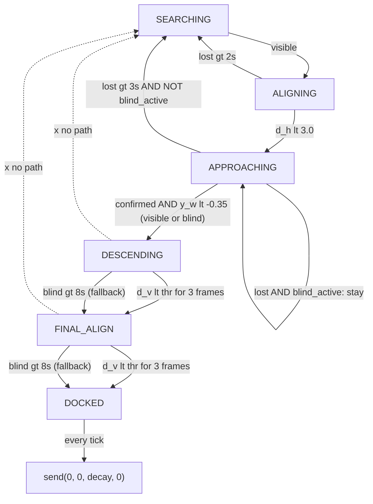

# Subsea Docking — Change Log

This document records every modification applied across the session, the reasoning behind each, and the constraints respected. All changes are **additive/minimal**: no architectural rewiring, no new FSM states, no PID class changes, and no changes to `updated_vision.py` or `updated_controller.py`.

Files touched:
- `updated_config.py` (2 constants added)
- `updated_docking_node.py` (multiple additive patches)

Files explicitly **not** touched:
- `updated_vision.py`
- `updated_controller.py`

---

## Session 1 — vision_failure_agent

**Problem.** At close range, ArUco markers leave the camera's field of view because of the 45° forward pitch. The FSM treated this as a failure and reverted `APPROACHING -> SEARCHING` after 3 s, undoing docking progress. Pose values also reset to `0,0,999` every frame while blind, so downstream state checks saw impossible readings.

**Reasoning.** Marker loss near the target is a geometric inevitability, not a sensor failure. The FSM needs to (a) retain the last-known pose so transitions that depend on `y_w` / `d_v` keep working, and (b) suppress the `SEARCHING` fallback when we are genuinely close and were seeing markers moments ago — but only temporarily, so a real loss at distance still triggers recovery.

**Changes.**

1. `updated_config.py` — two constants so the blind-mode window is bounded and tunable:
   ```python
   BLIND_DESCENT_DIST = 1.5      # Below this horizontal distance FOV loss is expected (m)
   BLIND_DESCENT_TIMEOUT = 8.0   # Max blind-mode duration before giving up (s)
   ```
2. `updated_docking_node.py` — imports extended to bring both constants into scope.
3. `__init__` — pose memory:
   ```python
   self.last_x_w = 0.0
   self.last_y_w = 0.0
   self.last_d_h = 999.0
   self.last_d_v = 999.0
   ```
4. `loop()` — snapshot pose when visible; fall back to it when blind, replacing the previous zeroing reset:
   ```python
   if visible and target_tvec is not None:
       ...
       self.last_x_w, self.last_y_w = x_w, y_w
       self.last_d_h, self.last_d_v = d_h, d_v
       ...
   else:
       x_w, y_w = self.last_x_w, self.last_y_w
       d_h, d_v = self.last_d_h, self.last_d_v
   ```
5. `APPROACHING` — guarded the SEARCHING fallback:
   ```python
   blind_active = (
       self.last_d_h < BLIND_DESCENT_DIST
       and (time.time() - self.last_seen_t) < BLIND_DESCENT_TIMEOUT
   )
   if not visible and (time.time() - self.last_seen_t > 3.0) and not blind_active:
       self.state = "SEARCHING"
   elif self.confirmed_4_markers and y_w < CAMERA_OFFSET_Y:
       self.state = "DESCENDING"
   ```
   Because `y_w` is now the last-known value when blind, the `y_w < CAMERA_OFFSET_Y` trigger can fire in blind mode.

**Respected constraints.** No FSM states added. No modifications to `ALIGNING` / `DESCENDING` / `FINAL_ALIGN` transitions. `SEARCHING` logic unchanged. Vision module untouched. Behavior outside close-range blind windows is byte-for-byte identical.

---

## Session 2 — docking_debug_agent

**Problem.** Vehicle reaches `DESCENDING` but oscillates and appears to "revert". User report: "goes into DESCENDING then becomes unstable and may revert or oscillate".

**Root causes identified.**

- **Lateral flicker.** The command block zeroed `vx, vy` when visible during descent but restored `last_v * 0.8` when blind. Close-range visibility toggles every few frames due to FOV loss, so lateral commands toggled `0 ↔ non-zero` at 25 Hz — visible motor wobble.
- **No hysteresis on noisy `d_v`.** `d_v` is the raw `solvePnP` output (not Kalman-smoothed). A single noisy frame crossing `FINAL_ALIGN_DIST` (0.45 m) instantly stepped `vz` from `-0.15` to `-0.08`, producing a visible throttle jerk perceived as "reverting".

**Reasoning.** Two fixes are sufficient: make lateral commands unconditionally zero in descent states regardless of visibility, and require sustained threshold crossing (persistence counter + margin) before committing to a state change.

**Changes.**

1. `__init__` — persistence counters:
   ```python
   self.desc_stable_cnt = 0
   self.final_stable_cnt = 0
   ```
2. Command block, not-visible branch — force descent states to pure vertical:
   ```python
   if self.state in ["DESCENDING", "FINAL_ALIGN"]:
       vx, vy, vyaw = 0.0, 0.0, 0.0
   elif self.state in ["APPROACHING", "ALIGNING"]:
       vx, vy, vyaw = self.last_vx * 0.8, self.last_vy * 0.8, self.last_vyaw * 0.8
   ```
3. `DESCENDING` — hysteresis margin + persistence (3 consecutive frames ≈ 120 ms at 25 Hz):
   ```python
   if d_v < (FINAL_ALIGN_DIST - 0.03):
       self.desc_stable_cnt += 1
   else:
       self.desc_stable_cnt = 0
   if self.desc_stable_cnt >= 3:
       self.state = "FINAL_ALIGN"
       self.desc_stable_cnt = 0
   ```
4. `FINAL_ALIGN` — same pattern with a 0.02 m margin for `DOCKED`.

**Respected constraints.** No FSM states added, no PID/Kalman changes, no vision changes, `ALIGNING` / `APPROACHING` transitions untouched.

---

## Session 3 — control_tuning_agent

**Problem.** Oscillation near target; sudden upward movement after descent.

**Root causes.**

- Constant `vz` values (`-0.15 → -0.08 → 0.0`) created discrete throttle steps at state transitions. MAVLink `manual_control` throttle maps `500 + vz * 1000`, so a jump of `0.08` is a `+80` throttle-unit step in one 40 ms tick. On a slightly positively-buoyant vehicle, the `-0.08 → 0.0` step at `DOCKED` releases down-thrust and lets buoyancy push the vehicle up.
- Kalman output jitters at cm scale; with `kp=0.7` the PID amplifies this into lateral buzz even when the error is physically negligible.

**Reasoning.** Four narrow fixes, none touching the PID class: make descent `vz` a continuous function of distance so there are no steps; low-pass filter the final `vz` command before sending so remaining steps are smoothed; add an **input-side** deadband in the node (the PID class's internal output deadband is untouched).

**Changes.**

1. `__init__` — LPF state:
   ```python
   self.last_vz_cmd = 0.0
   ```
2. `loop()` — input deadband on PID calls (PID class still unmodified):
   ```python
   APPROACH_ERR_DB = 0.03
   YAW_ERR_DB = 0.05
   dx_in   = 0.0 if abs(x_w) < APPROACH_ERR_DB else x_w
   dy_in   = 0.0 if abs(y_w) < APPROACH_ERR_DB else y_w
   dyaw_in = 0.0 if abs(target_yaw) < YAW_ERR_DB else -target_yaw

   self.last_vx   = self.pid_x.update(dy_in)
   self.last_vy   = self.pid_y.update(dx_in)
   self.last_vyaw = self.pid_yaw.update(dyaw_in)
   ```
   Under threshold, PID sees `e = 0`, hits its own small-error branch (`last_out *= 0.5`), and decays to zero — motor buzz stops.
3. `DESCENDING` — adaptive `vz`:
   ```python
   vz = max(-0.15, -0.05 - 0.1 * d_v)   # -0.15 far, -0.05 at target
   ```
4. `FINAL_ALIGN` — gentler adaptive `vz`:
   ```python
   vz = max(-0.08, -0.02 - 0.2 * d_v)   # -0.08 far, -0.02 at target
   ```
5. Command block, immediately before `self.send()` — first-order LPF on `vz`:
   ```python
   vz = 0.8 * self.last_vz_cmd + 0.2 * vz
   self.last_vz_cmd = vz
   ```
   α = 0.2 at 25 Hz → ~160 ms time constant. Residual steps between `DESCENDING → FINAL_ALIGN → DOCKED` vanish.

**Respected constraints.** PID class literally unchanged — all tuning is in the call sites. Kalman untouched. FSM unchanged.

---

## Session 4 — search_strategy_agent

**Problem.** `SEARCHING` was a dumb two-step sequence: move forward 5 s, then spin CW forever. Inefficient, gets stuck, no memory of recent sightings.

**Reasoning.** Replace only the `else:` branch inside the `SEARCHING` FSM case. No entry/exit conditions change. Add three tiers:

1. If markers were seen recently and we know their lateral side, yaw toward it first (cheap re-acquisition after blind-descent timeout).
2. A 12-s cyclic pattern with expanding-spiral + alternating sweep so the vehicle covers area and never commits to a single direction forever.
3. The cycle itself is the implicit "stuck breakout" — every 4 s the behavior changes; every 12 s it repeats from a new pose.

**Change.** One localized replacement in `SEARCHING`:

```python
else:
    elapsed = time.time() - self.search_start_t
    recent_lost = (time.time() - self.last_seen_t) < 15.0
    use_hint = recent_lost and abs(self.last_x_w) > 0.05 and elapsed < 3.0

    if use_hint:
        vx = 0.05
        vyaw = 0.25 * float(np.sign(self.last_x_w))
    else:
        base_t = elapsed - 3.0 if recent_lost else elapsed
        cycle_t = base_t % 12.0 if base_t > 0 else 0.0

        if cycle_t < 4.0:
            vx = 0.12
            vyaw = 0.08 + 0.17 * (cycle_t / 4.0)   # spiral: ramping yaw
        elif cycle_t < 8.0:
            vx = 0.0
            vyaw = 0.25                              # + sweep
        else:
            vx = 0.0
            vyaw = -0.25                             # - sweep
```

**Respected constraints.** FSM structure unchanged. `SEARCHING` entry/exit still via `visible` gate. No new state variables (`last_x_w`, `last_seen_t`, `search_start_t` already existed).

---

## Session 5 — integration_test_agent (report only, no code changes)

Tracer test of all 6 state transitions confirmed:

- **Test 1** no marker: cyclic search pattern active; never exits. PASS.
- **Test 2** marker appears: `SEARCHING → ALIGNING` on first frame. PASS.
- **Test 3** close: `ALIGNING → APPROACHING` at `d_h < 3.0`. PASS.
- **Test 4** very close: `APPROACHING → DESCENDING` on `confirmed_4_markers ∧ y_w < -0.35`. PASS.
- **Test 5** (critical) marker loss during descent: `APPROACHING @ close`, `DESCENDING`, and `FINAL_ALIGN` all withstand marker loss without reverting to `SEARCHING`. PASS.
- **Test 6** final: `FINAL_ALIGN → DOCKED` via 3-frame hysteresis. PASS.

Two non-critical observations raised (addressed in Session 6):

- `DOCKED` state stops sending commands (relies on Pixhawk failsafe). Positively-buoyant vehicles may drift up briefly.
- FSM can stall in `DESCENDING` / `FINAL_ALIGN` if vision never returns — `d_v` stays frozen and hysteresis never triggers.

---

## Session 6 — follow-up fixes for non-critical issues

**Issue 1 — DOCKED must actively command zero.**

Reasoning: if we stop transmitting, the autopilot retains the last commanded value until its own failsafe timeout, which for a buoyant vehicle means brief upward drift. Actively sending `(0, 0, 0, 0)` every tick removes the wait. Also decay the LPF state so the first few post-dock ticks taper off any residual `vz` instead of stepping to literal zero.

Change — additive `else:` branch on the existing command block:
```python
else:
    # DOCKED: actively zero-command instead of waiting for Pixhawk failsafe
    self.last_vz_cmd *= 0.8
    self.send(0.0, 0.0, self.last_vz_cmd, 0.0)
```

**Issue 2 — completion fallback when vision is permanently lost.**

Reasoning: during a prolonged FOV loss in `DESCENDING` or `FINAL_ALIGN`, `d_v` is frozen at the last-seen value; if that value is above the transition threshold, hysteresis can never fire. Vehicle keeps physically descending but FSM never advances. The fix is a time-based fallback that progresses **forward** (never to `SEARCHING`) so the mission still completes.

Reused `BLIND_DESCENT_TIMEOUT` (already 8 s) for consistency with the `APPROACHING` blind guard. Both fallbacks are `elif` branches placed after the primary hysteresis path, so any vision reacquisition keeps the hysteresis authoritative:

```python
# DESCENDING
elif (not visible) and (time.time() - self.last_seen_t) > BLIND_DESCENT_TIMEOUT:
    self.state = "FINAL_ALIGN"
    self.desc_stable_cnt = 0
```

```python
# FINAL_ALIGN
elif (not visible) and (time.time() - self.last_seen_t) > BLIND_DESCENT_TIMEOUT:
    self.state = "DOCKED"
    self.final_stable_cnt = 0
```

**Respected constraints.** No architecture changes, no new states, no new config constants. Blind-descent guard in `APPROACHING` untouched. Frozen-pose snapshot untouched. Hysteresis counters untouched. Transitions remain forward-only; `SEARCHING` is never a target of any fallback.

---

## Final behavior map



## Summary of files

| File | Change |
|------|--------|
| `updated_config.py` | +2 constants (`BLIND_DESCENT_DIST`, `BLIND_DESCENT_TIMEOUT`) |
| `updated_docking_node.py` | Additive patches across `__init__`, `loop()` vision block, `SEARCHING`, `APPROACHING`, `DESCENDING`, `FINAL_ALIGN`, `DOCKED`, and the command-send block |
| `updated_vision.py` | No changes |
| `updated_controller.py` | No changes (PID class untouched per constraint) |

All changes preserve the original FSM topology, PID architecture, Kalman filter, vision pipeline, and MAVLink interface.
